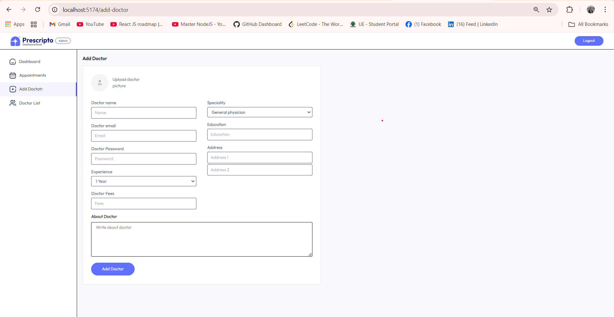

⭐ If you found this project helpful, please consider giving it a star on GitHub!

# 🏥 Doctor Appointment Booking System (MERN Stack)

[]()
[]()
[]()
[]()
[]()
[]()

---

## 📬 Contact

Developer: Muhammad Amjad

Email: amjadbinaslam604@gmail.com

LinkedIn: https://www.linkedin.com/in/amjad-bin-aslam-58813530b

GitHub: https://github.com/Amjad-Bin-Aslam

---

## 📖 Project Description

This project is a **Doctor Appointment Booking System** built using **MongoDB, Express.js, React.js, Node.js, and Tailwind CSS**, integrated with **Stripe** for online payments.  

It provides a complete platform for **admins**, **doctors**, and **patients** to manage appointments efficiently.  
Patients can register, log in, book or cancel appointments, and pay online.  
Doctors can manage their profiles, availability, and view earnings, while admins can manage doctors, their details, and oversee appointments — all from a unified admin dashboard.

The **backend** is powered by **Express.js** and **Node.js**, with a **MongoDB** database for secure and scalable data handling.  
The **frontend** and **admin/doctor panels** are built in **React.js**, styled with **Tailwind CSS** for a modern, responsive UI.

🔗 **Live Demo / Repository:**  
<!-- [👉 View on GitHub](https://github.com/Amjad-Bin-Aslam/Doctor_Appointment_System_Full_Stack) -->
[👉 View on Github](https://github.com/Amjad-Bin-Aslam/Doctor_Appointment_System_Full_Stack)

---

## ⚙️ Features

### 👤 User (Patient)
- Register and log in securely  
- Browse doctors by specialization  
- Book and cancel appointments  
- Pay securely using **Stripe**  
- View personal appointment history  
- Can edit their profile

### 🧑‍⚕️ Doctor Panel (Inside Admin)
- Login and manage personal information  
- Update profile, availability, and consultation fee  
- View appointment bookings  
- Track total earnings and patients count  

### 👨‍💼 Admin Panel
- Add or remove doctors  
- Edit doctor details and availability  
- Monitor bookings and payments  
- Manage platform statistics  

---

## 🚀 Tech Stack

| Layer | Technology |
|-------|-------------|
| Frontend | React.js, Tailwind CSS |
| Admin / Doctor Panel | React.js, Context API, Tailwind CSS |
| Backend | Node.js, Express.js |
| Database | MongoDB (Mongoose) |
| Authentication | JWT (JSON Web Token) |
| Payments | Stripe |
| Tools | Axios, React Router, VS Code, Nodemon |

---

## 🧠 Learning Outcome

This project helped me understand:
- How to structure a **multi-role MERN stack** application  
- Implementing **JWT authentication** for multiple user roles  
- Integrating **Stripe payment gateway** in a full-stack app  
- Managing global state using React Context API  
- Building **responsive layouts** using Tailwind CSS  
- Designing a clean and user-friendly admin dashboard  

---

## 🙏 Acknowledgment

I would like to express my sincere gratitude to **Muhammad Aqib**, my mentor, for his valuable guidance and constant encouragement during the development of this project.  
His mentorship helped me understand advanced **MERN concepts**, project structuring, and industry-level development practices.

---

## 📸 Screenshot





---

## 💻 Setup Instructions

```bash
# Clone the repository
git clone https://github.com/Amjad-Bin-Aslam/Doctor_Appointment_System_Full_Stack

# Navigate into the project folder
cd doctor-appointment-system

# Install dependencies for backend
cd backend
npm install

# Start backend server
npm run dev

# Setup frontend (User)
cd ../frontend
npm install
npm run dev

# Setup admin/doctor panel
cd ../admin
npm install
npm run dev
